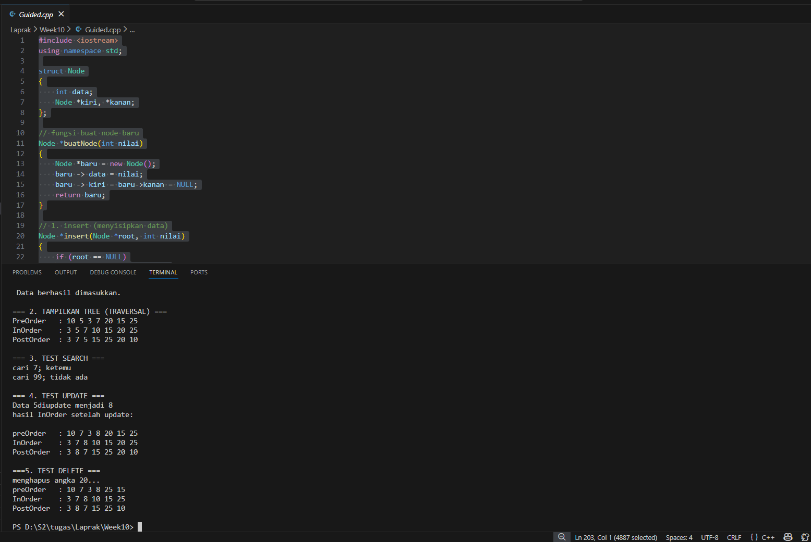
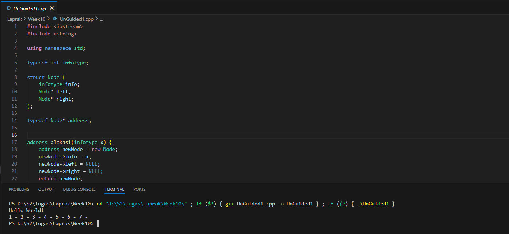
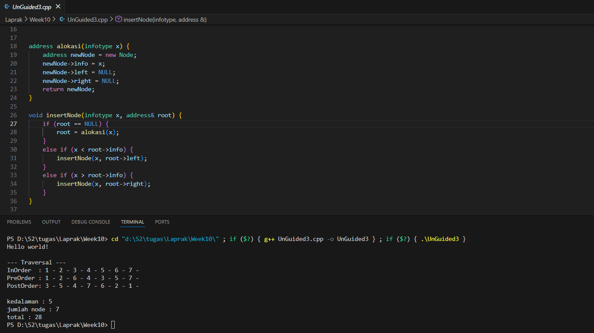

# <h1 align="center">Laporan Praktikum Modul 10 <br> </h1>
<p align="center"> Luthfi Maolana Andhika W - 103112430181 </p>

## Dasar Teori

Pada materi ini menjelaskan tentang Tree. Tree adalah struktur data hierarkis yang digunakan untuk mengatur dan merepresentasikan data dalam hubungan induk-anak . Tree terdiri dari simpul-simpul, dengan simpul teratas disebut akar , dan setiap simpul lainnya dapat memiliki satu atau lebih simpul anak .

## Guided

```go
#include <iostream>
using namespace std;

struct Node
{
    int data;
    Node *kiri, *kanan;
};

// fungsi buat node baru
Node *buatNode(int nilai)
{
    Node *baru = new Node();
    baru -> data = nilai;
    baru -> kiri = baru->kanan = NULL;
    return baru;
}

// 1. insert (menyisipkan data)
Node *insert(Node *root, int nilai)
{
    if (root == NULL)
        return buatNode(nilai);

    if (nilai < root->data)
        root->kiri = insert(root->kiri, nilai); // masuk kiri jika lebih kecil
    else if (nilai > root->data)
        root->kanan  = insert(root->kanan, nilai); // masuk kanan jika lebih besar
    
    return root;
}

//2, search (mencari data)
Node *search(Node *root, int nilai)
{
    if (root == NULL || root->data == nilai)
        return root; // ketemu atau tidak ada

    if (nilai < root-> data)
        return search(root->kiri, nilai); // cari ke kiri

    return search(root->kanan, nilai); // cari ke kanan
}

// helper: cari nilai terkecil (untuk proses hapus)
Node *nilaiTerkecil(Node *node)
{
    Node *current = node;
    while (current && current->kiri != NULL)
        current = current->kiri;
    return current;
}

//3. delete (menghapus data - diperlukan untuk update)
Node *hapus(Node *root, int nilai)
{
    if (root == NULL)
        return root;

    if (nilai < root->data)
        root->kiri = hapus(root->kiri, nilai);
    else if (nilai > root->data)
        root->kanan = hapus(root->kanan, nilai);
    else
    {
        //jika data ketemu
        if (root->kiri == NULL)
        {
            Node *temp = root->kanan;
            delete root;
            return temp;
        }
        else if (root->kanan == NULL)
        {
            Node *temp = root->kiri;
            delete root;
            return temp;
        }
        //jika punya 2 anak: ambil terkecil dari kanan
        Node *temp = nilaiTerkecil(root->kanan);
        root->data = temp->data;
        root->kanan = hapus(root->kanan, temp->data); 
    }
    return root;
}

//4, update(ubah data)
Node *update(Node *root, int Lama, int baru)
{
    if (search(root, Lama) != NULL)
    {
        root = hapus(root, Lama); // hapus yang lama
        root = insert(root, baru); // masukkan yang baru
        cout << "Data " << Lama << "diupdate menjadi " << baru << endl;
    }
    else
    {
        cout << "data " << Lama << "tidak ditemukan!" << endl;
    }
    return root;
}

//5, treversal (menampilkan data)
void preOrder(Node *root)
{// akar -> kiri ->kanan
    if (root != NULL)
    {
        cout << root->data << " ";
        preOrder(root->kiri);
        preOrder(root->kanan);
    }
}

void inOrder(Node *root)
{// kiri -> akar _>kanan
    if (root != NULL)
    {
        inOrder(root->kiri);
        cout << root->data << " ";
        inOrder(root->kanan);
    }
}

void postOrder(Node *root)
{ // kiri-> kanan -> akar
    if (root != NULL)
    {
        postOrder(root->kiri);
        postOrder(root->kanan);
        cout << root->data << " ";
    }
}

int main()
{
    Node *root = NULL;

    cout << "=== 1. INSERT DATA ===" << endl;
    root = insert(root, 10);
    insert(root, 5);
    insert(root, 20);
    insert(root, 3);
    insert(root, 7);
    insert(root, 15);
    insert(root, 25);
    cout << " Data berhasil dimasukkan.\n"
        << endl;

    cout << "=== 2. TAMPILKAN TREE (TRAVERSAL) ===" << endl;
    cout << "PreOrder   : ";
    preOrder(root);
    cout << endl;
    cout << "InOrder    : "; 
    inOrder(root);
    cout << endl;
    cout << "PostOrder  : ";
    postOrder(root);
    cout << "\n"
        << endl;

    cout << "=== 3. TEST SEARCH ===" << endl;
    int cari1 = 7, cari2 = 99;
    cout << "cari " << cari1 << "; " << (search(root, cari1) ? "ketemu" : "tidak ada") << endl;
    cout << "cari " << cari2 << "; " << (search(root, cari2) ? "ketemu" : "tidak ada") << endl;
    cout << endl;

    cout << "=== 4. TEST UPDATE ===" << endl;
    // mengubah 5 angka menjadi 8
    root = update(root, 5, 8);
    cout << "hasil InOrder setelah update: ";
    cout << endl;
    cout << endl;

    cout << "preOrder   : ";
    preOrder(root);
    cout << endl;
    cout << "InOrder    : "; 
    inOrder(root);
    cout << endl;
    cout << "PostOrder  : ";
    postOrder(root);
    cout << "\n"
        << endl;
    
    cout << "===5. TEST DELETE ===" << endl;
    // menghapus angka 20(node yang punya anak)
    cout << "menghapus angka 20..." << endl;
    root = hapus(root, 20);

    cout << "preOrder   : ";
    preOrder(root);
    cout << endl;
    cout << "InOrder    : "; 
    inOrder(root);
    cout << endl;
    cout << "PostOrder  : ";
    postOrder(root);
    cout << "\n"
        << endl;

    return 0;    
}        

```

> 

Program di atas merupakan implementasi Binary Search Tree (BST) yang mendukung operasi utama yaitu insert, search, delete, update, dan traversal. Struktur Node menyimpan data serta pointer ke anak kiri dan kanan, sedangkan fungsi buatNode digunakan untuk membuat node baru. Proses insert menempatkan data sesuai aturan BST (lebih kecil ke kiri, lebih besar ke kanan), search mencari data secara rekursif berdasarkan perbandingan nilai, dan hapus menghilangkan node dengan mempertimbangkan tiga kondisi (node tanpa anak, satu anak, atau dua anak dengan mengganti nilai menggunakan node terkecil di subtree kanan). Fungsi update dilakukan dengan cara menghapus data lama lalu menyisipkan data baru. Untuk menampilkan isi tree, disediakan traversal preorder, inorder, dan postorder. Pada main, program mendemonstrasikan seluruh operasi tersebut sehingga pengguna dapat melihat perubahan struktur tree sebelum dan sesudah update maupun delete.

## Unguided

### Soal 1

```go
#include <iostream>
#include <string>

using namespace std;

typedef int infotype;

struct Node {
    infotype info;
    Node* left;
    Node* right;
};

typedef Node* address;


address alokasi(infotype x) {
    address newNode = new Node;
    newNode->info = x;
    newNode->left = NULL;
    newNode->right = NULL;
    return newNode;
}

void insertNode(infotype x, address& root) {
    if (root == NULL) {
        root = alokasi(x);
    }
    else if (x < root->info) {
        insertNode(x, root->left);
    }
    else if (x > root->info) {
        insertNode(x, root->right);
    }
}

address findNode(infotype x, address root) {
    if (root == NULL || root->info == x) {
        return root;
    } 
    else if (x < root->info) {
        return findNode(x, root->left);
    } 
    else { 
        return findNode(x, root->right);
    }
}

void printinorder(address root) {
    if (root != NULL) {
        printinorder(root->left);
        cout << root->info << " - ";
        printinorder(root->right);
    }
}

int main()
{
    cout << "Hello World!" << endl;
    
    address root = NULL;

    insertNode(1, root);
    insertNode(2, root);
    insertNode(6, root);
    insertNode(4, root);
    insertNode(5, root);
    insertNode(3, root);
    insertNode(7, root);
    printinorder(root); 
    cout << endl;

    return 0;
}
```

> 

Pada program di atas kita disuruh untuk membuat ADT Binary Search Tree menggunakan Linked list, buat struct Node verisi info, pointer ke kiri dan kanan. buat fungsi fungsinnya yaitu alokasi, insertNode,findNode dan printNode

lalu pada fungsi main kita tambahkan output "Hello World!" diawal serta inisiasi root, lalu tambahkan angka dummy agar sesuai dengan output yang diinginkan.

### Soal 2

```go
#include <iostream>
#include <algorithm> // Diperlukan untuk std::max

using namespace std;


typedef int infotype;

struct Node {
    infotype info;
    Node* left;
    Node* right;
};

typedef Node* address;


address alokasi(infotype x) {
    address newNode = new Node;
    newNode->info = x;
    newNode->left = NULL;
    newNode->right = NULL;
    return newNode;
}

void insertNode(infotype x, address& root) {
    if (root == NULL) {
        root = alokasi(x);
    }
    else if (x < root->info) {
        insertNode(x, root->left);
    }
    else if (x > root->info) {
        insertNode(x, root->right);
    }
}

address findNode(infotype x, address root) {
    if (root == NULL || root->info == x) {
        return root;
    } 
    else if (x < root->info) {
        return findNode(x, root->left);
    } 
    else {
        return findNode(x, root->right);
    }
}

void InOrder(address root) {
    if (root != NULL) {
        InOrder(root->left);
        cout << root->info << " - ";
        InOrder(root->right);
    }
}


// Mengembalikan banyak node yang ada di dalam BST
int hitungNode(address root) {
    if (root == NULL) {
        return 0;
    }
    return hitungNode(root->left) + hitungNode(root->right) + 1;
}

// Mengembalikan jumlah (total) info dari node-node yang ada di dalam BST
int hitungTotalInfo(address root) {
    if (root == NULL) {
        return 0;
    }
    return hitungTotalInfo(root->left) + hitungTotalInfo(root->right) + root->info;
}

// Mengembalikan kedalaman maksimal (tinggi) dari binary tree
int hitungKedalaman(address root) {
    if (root == NULL) {
        return 0;
    }
    
    int kedalamanKiri = hitungKedalaman(root->left);
    int kedalamanKanan = hitungKedalaman(root->right);
    
    // Menggunakan std::max dari <algorithm>
    return max(kedalamanKiri, kedalamanKanan) + 1;
}


int main()
{
    cout << "Hello world!" << endl;
    
    address root = NULL;

    insertNode(1, root);
    insertNode(2, root);
    insertNode(6, root);
    insertNode(4, root);
    insertNode(5, root);
    insertNode(3, root);
    insertNode(6, root); 
    insertNode(7, root);

    InOrder(root); 
    cout << "\n";

    cout << "kedalaman : " << hitungKedalaman(root) << endl; 
    cout << "jumlah node : " << hitungNode(root) << endl;
    cout << "total : " << hitungTotalInfo(root) << endl;


    return 0;
}
```

> Output
> 

Pada program di atas kita disuruh untuk membuat fungsi untuk menghitung jumlah node, buat struct Node berisi info,pointer kekiri dan kanan.uat fungsi fungsinnya yaitu alokasi, insertNode,findNode, InOrder, hitungNode, hitungTotalInfo, hitungKedalaman
lalu pada fungsi main kita tambahkan output "Hello World!" diawal serta inisiasi root, lalu tambahkan angka dummy agar sesuai dengan output yang diinginkan. Untuk kode ini kita tampilkan juga kedalaman, jumlah node dan total infonya

###soal 3

```go
#include <iostream>
#include <algorithm> // Diperlukan untuk std::max

using namespace std;


typedef int infotype;

struct Node {
    infotype info;
    Node* left;
    Node* right;
};

typedef Node* address;


address alokasi(infotype x) {
    address newNode = new Node;
    newNode->info = x;
    newNode->left = NULL;
    newNode->right = NULL;
    return newNode;
}

void insertNode(infotype x, address& root) {
    if (root == NULL) {
        root = alokasi(x);
    }
    else if (x < root->info) {
        insertNode(x, root->left);
    }
    else if (x > root->info) {
        insertNode(x, root->right);
    }
}


// Mengembalikan kedalaman maksimal (tinggi) dari binary tree
int hitungKedalaman(address root) {
    if (root == NULL) {
        return 0;
    }
    int kedalamanKiri = hitungKedalaman(root->left);
    int kedalamanKanan = hitungKedalaman(root->right);
    return max(kedalamanKiri, kedalamanKanan) + 1;
}

// Mengembalikan banyak node yang ada di dalam BST
int hitungNode(address root) {
    if (root == NULL) {
        return 0;
    }
    return hitungNode(root->left) + hitungNode(root->right) + 1;
}

// Mengembalikan total info dari node-node yang ada di dalam BST
int hitungTotalInfo(address root) {
    if (root == NULL) {
        return 0;
    }
    return hitungTotalInfo(root->left) + hitungTotalInfo(root->right) + root->info;
}


// Urutan: Kiri -> Root -> Kanan
void InOrder(address root) {
    if (root != NULL) {
        InOrder(root->left);
        cout << root->info << " - ";
        InOrder(root->right);
    }
}

// Urutan: Root -> Kiri -> Kanan
void PreOrder(address root) {
    if (root != NULL) {
        cout << root->info << " - "; 
        PreOrder(root->left);        
        PreOrder(root->right);       
    }
}

// Urutan: Kiri -> Kanan -> Root
void PostOrder(address root) {
    if (root != NULL) {
        PostOrder(root->left);       
        PostOrder(root->right);      
        cout << root->info << " - "; 
    }
}


int main()
{
    cout << "Hello world!" << endl;
    
    address root = NULL;

    insertNode(1, root);
    insertNode(2, root);
    insertNode(6, root);
    insertNode(4, root);
    insertNode(5, root);
    insertNode(3, root);
    insertNode(7, root); // 6 diabaikan karena duplikat


    cout << "\n--- Traversal ---" << endl;
    
    cout << "InOrder  : ";
    InOrder(root); 
    cout << endl;

    cout << "PreOrder : ";
    PreOrder(root);
    cout << endl;
    
    cout << "PostOrder: ";
    PostOrder(root);
    cout << "\n" << endl;


    cout << "kedalaman : " << hitungKedalaman(root) << endl; 
    cout << "jumlah node : " << hitungNode(root) << endl;
    cout << "total : " << hitungTotalInfo(root) << endl;

    return 0;
}
```

> 

Program diatas persis seperti program sebeliumnya hanya kita harus menambahkan print tree secara pre-order dan post-order. Fungsi tambahan yaitu PreOrder dan PostOrder dengan urutan root->kiri->kanan.fungsi tersebut kita panggil pada fungsi mainnya.

## Referensi

1. https://www.geeksforgeeks.org/dsa/introduction-to-tree-data-structure/ (diakses 8/12/2025)
