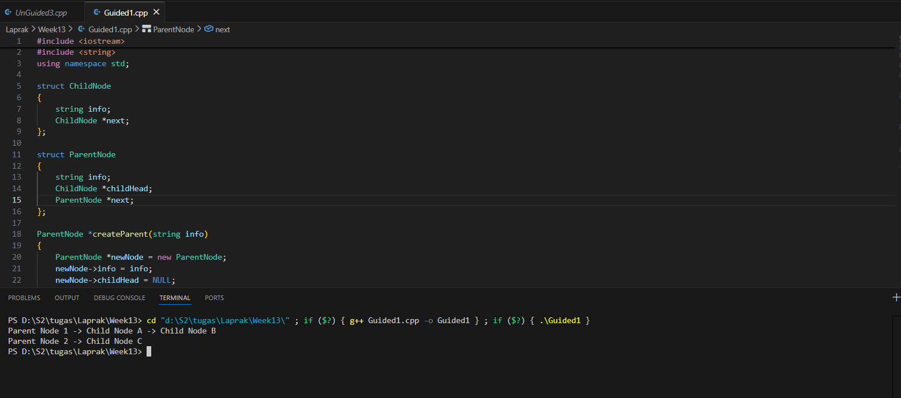
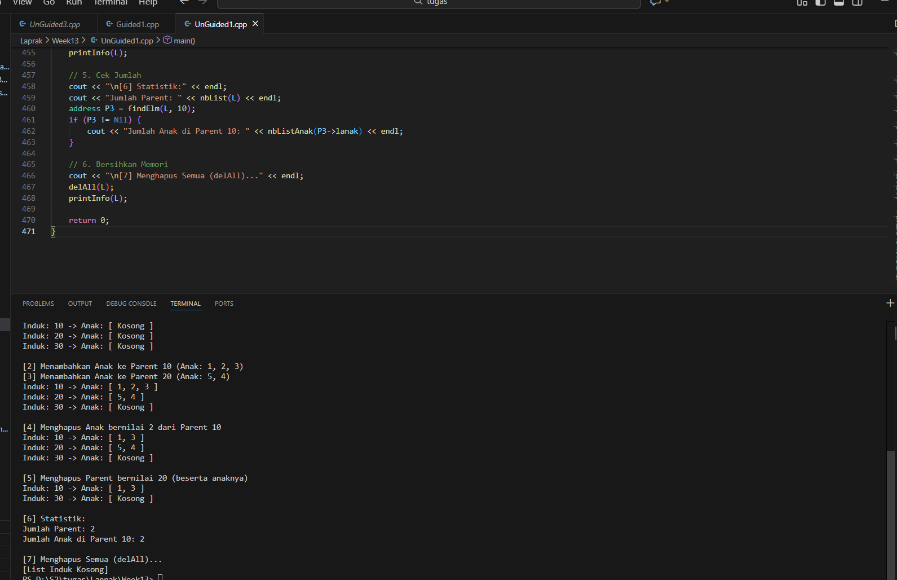
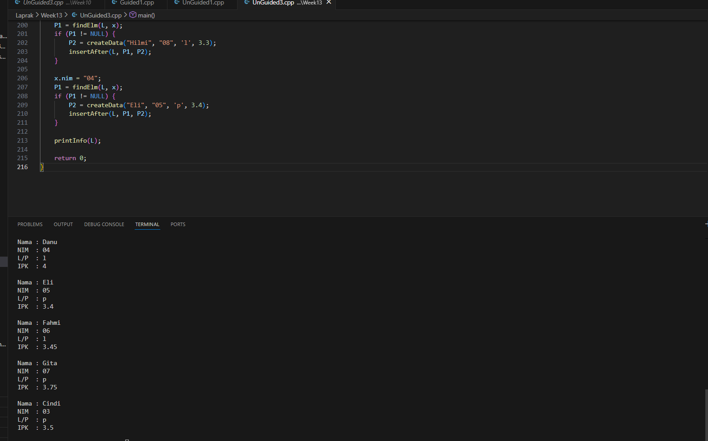

# <h1 align="center">Laporan Praktikum Modul 13 <br> </h1>
<p align="center"> Luthfi Maolana Andhika W - 103112430181 </p>

## Dasar Teori

Pada materi ini menjelaskan tentang Multi Linked List. Multi Linked List adalah Multi linked list adalah jenis list khusus yang berisi dua atau lebih rangkaian kunci logis. Dalam daftar multi-link, setiap simpul dapat memiliki N pointer ke simpul lain. Daftar multi-link umumnya digunakan untuk mengatur beberapa urutan elemen dalam satu set.

## Guided

### soal 1

```go
#include <iostream>
#include <string>
using namespace std;

struct ChildNode
{
    string info;
    ChildNode *next;
};

struct ParentNode
{
    string info;
    ChildNode *childHead;
    ParentNode *next;
};

ParentNode *createParent(string info)
{
    ParentNode *newNode = new ParentNode;
    newNode->info = info;
    newNode->childHead = NULL;
    newNode->next = NULL;
    return newNode;
}

ChildNode *createChild(string info)
{
    ChildNode *newNode = new ChildNode;
    newNode->info = info;
    newNode->next = NULL;
    return newNode;
}

void insertParent(ParentNode *&head, string info)
{
    ParentNode *newNode = createParent(info);
    if (head == NULL)
    {
        head = newNode;
    }
    else
    {
        ParentNode *temp = head;
        while (temp->next != NULL)
        {
            temp = temp->next;
        }
        temp->next = newNode;
    }
}

void insertChild(ParentNode *head, string parentInfo, string childInfo)
{
    ParentNode *p = head;
    while (p != NULL && p->info != parentInfo)
    {
        p = p->next;
    }

    if (p != NULL)
    {
        ChildNode *newChild = createChild(childInfo);
        if (p->childHead == NULL)
        {
            p->childHead = newChild;
        }
        else 
        {
            ChildNode *c = p->childHead;
            while (c->next != NULL)
            {
                c = c->next;
            }
            c->next = newChild;
        }
    }
}

void printAll(ParentNode *head)
{
    ParentNode *p = head;
    while (p != NULL)
    {
        cout << p->info;
        ChildNode *c = p->childHead;
        if (c != NULL)
        {
            while (c != NULL)
            {
                cout << " -> " << c->info;
                c = c->next;
            }
        }
        cout << endl;
        p = p->next;
    }
}

int main()
{
    ParentNode *list = NULL;

    insertParent(list, "Parent Node 1");
    insertParent(list, "Parent Node 2");

    insertChild(list, "Parent Node 1", "Child Node A");
    insertChild(list, "Parent Node 1", "Child Node B");
    insertChild(list, "Parent Node 2", "Child Node C");

    printAll(list);

    return 0;
}
```
> 

Pada progeam diatas kita membuat sebuah implementasi Multi Linked List, buat struct ChildNode berisi string info dan pointer next, serta buat struct ParentNode berisi string info, pointer ke childHead sebagai anak pertama dan pointer next. Kita buat fungsi fungsinya yaitu createParent, createChild, insertParent,insertChild, printAll

Lalu kita buat fungsi main nya kita buat list kososng setelahnya kita masukan data dummy

## Unguided

### Soal 1


```go
#include <iostream>
using namespace std;

#define Nil NULL
#define boolean bool
#define true 1
#define false 0

typedef int infotypeanak;
typedef int infotypeinduk;
typedef struct elemen_list_induk *address;
typedef struct elemen_list_anak *address_anak;

struct elemen_list_anak {
    infotypeanak info;
    address_anak next;
    address_anak prev;
};

struct listanak {
    address_anak first;
    address_anak last;
};

struct elemen_list_induk {
    infotypeinduk info;
    listanak lanak; 
    address next;
    address prev;
};

struct listinduk {
    address first;
    address last;
};


/* Pengecekan */
boolean ListEmpty(listinduk L);
boolean ListEmptyAnak(listanak L);

/* Pembuatan List */
void CreateList(listinduk &L);
void CreateListAnak(listanak &L);

/* Manajemen Memori */
address alokasi(infotypeinduk P);
address_anak alokasiAnak(infotypeanak P);
void dealokasi(address P);
void dealokasiAnak(address_anak P);

/* Pencarian */
address findElm(listinduk L, infotypeinduk X);
address_anak findElmAnak(listanak Lanak, infotypeanak X);

/* Penambahan Elemen Induk */
void insertFirst(listinduk &L, address P);
void insertAfter(listinduk &L, address P, address Prec);
void insertLast(listinduk &L, address P);

/* Penambahan Elemen Anak */
void insertFirstAnak(listanak &L, address_anak P);
void insertAfterAnak(listanak &L, address_anak P, address_anak Prec);
void insertLastAnak(listanak &L, address_anak P);

/* Penghapusan Elemen Induk */
void delFirst(listinduk &L, address &P);
void delLast(listinduk &L, address &P);
void delAfter(listinduk &L, address &P, address Prec);
void delP(listinduk &L, infotypeinduk X);

/* Penghapusan Elemen Anak */
void delFirstAnak(listanak &L, address_anak &P);
void delLastAnak(listanak &L, address_anak &P);
void delAfterAnak(listanak &L, address_anak &P, address_anak Prec);
void delPAnak(listanak &L, infotypeanak X);

/* Utilitas & Output */
void printInfo(listinduk L);
void printInfoAnak(listanak Lanak);
int nbList(listinduk L);
int nbListAnak(listanak Lanak);
void delAll(listinduk &L);


boolean ListEmpty(listinduk L) {
    return (L.first == Nil);
}

boolean ListEmptyAnak(listanak L) {
    return (L.first == Nil);
}

void CreateList(listinduk &L) {
    L.first = Nil;
    L.last = Nil;
}

void CreateListAnak(listanak &L) {
    L.first = Nil;
    L.last = Nil;
}


address alokasi(infotypeinduk P) {
    address newNode = new elemen_list_induk;
    if (newNode != Nil) {
        newNode->info = P;
        newNode->next = Nil;
        newNode->prev = Nil;
        CreateListAnak(newNode->lanak); 
    }
    return newNode;
}

address_anak alokasiAnak(infotypeanak P) {
    address_anak newNode = new elemen_list_anak;
    if (newNode != Nil) {
        newNode->info = P;
        newNode->next = Nil;
        newNode->prev = Nil;
    }
    return newNode;
}

void dealokasi(address P) {
    delete P;
}

void dealokasiAnak(address_anak P) {
    delete P;
}


address findElm(listinduk L, infotypeinduk X) {
    address P = L.first;
    while (P != Nil) {
        if (P->info == X) {
            return P;
        }
        P = P->next;
    }
    return Nil;
}

address_anak findElmAnak(listanak Lanak, infotypeanak X) {
    address_anak P = Lanak.first;
    while (P != Nil) {
        if (P->info == X) {
            return P;
        }
        P = P->next;
    }
    return Nil;
}


void insertFirst(listinduk &L, address P) {
    if (ListEmpty(L)) {
        L.first = P;
        L.last = P;
    } else {
        P->next = L.first;
        L.first->prev = P;
        L.first = P;
    }
}

void insertLast(listinduk &L, address P) {
    if (ListEmpty(L)) {
        insertFirst(L, P);
    } else {
        P->prev = L.last;
        L.last->next = P;
        L.last = P;
    }
}

void insertAfter(listinduk &L, address P, address Prec) {
    if (Prec != Nil) {
        if (Prec == L.last) {
            insertLast(L, P);
        } else {
            P->next = Prec->next;
            P->prev = Prec;
            Prec->next->prev = P;
            Prec->next = P;
        }
    }
}


void insertFirstAnak(listanak &L, address_anak P) {
    if (ListEmptyAnak(L)) {
        L.first = P;
        L.last = P;
    } else {
        P->next = L.first;
        L.first->prev = P;
        L.first = P;
    }
}

void insertLastAnak(listanak &L, address_anak P) {
    if (ListEmptyAnak(L)) {
        insertFirstAnak(L, P);
    } else {
        P->prev = L.last;
        L.last->next = P;
        L.last = P;
    }
}

void insertAfterAnak(listanak &L, address_anak P, address_anak Prec) {
    if (Prec != Nil) {
        if (Prec == L.last) {
            insertLastAnak(L, P);
        } else {
            P->next = Prec->next;
            P->prev = Prec;
            Prec->next->prev = P;
            Prec->next = P;
        }
    }
}


void delFirst(listinduk &L, address &P) {
    P = L.first;
    if (P != Nil) {
        if (L.first == L.last) {
            L.first = Nil;
            L.last = Nil;
        } else {
            L.first = P->next;
            L.first->prev = Nil;
            P->next = Nil;
        }
    }
}

void delLast(listinduk &L, address &P) {
    P = L.last;
    if (P != Nil) {
        if (L.first == L.last) {
            delFirst(L, P);
        } else {
            L.last = P->prev;
            L.last->next = Nil;
            P->prev = Nil;
        }
    }
}

void delAfter(listinduk &L, address &P, address Prec) {
    if (Prec != Nil && Prec->next != Nil) {
        P = Prec->next;
        if (P == L.last) {
            delLast(L, P);
        } else {
            Prec->next = P->next;
            P->next->prev = Prec;
            P->next = Nil;
            P->prev = Nil;
        }
    }
}

void delP(listinduk &L, infotypeinduk X) {
    address P = findElm(L, X);
    if (P != Nil) {
        address temp;
        if (P == L.first) {
            delFirst(L, temp);
        } else if (P == L.last) {
            delLast(L, temp);
        } else {
            delAfter(L, temp, P->prev);
        }
        
        address_anak PAnak = P->lanak.first;
        while (PAnak != Nil) {
            address_anak tempAnak;
            delFirstAnak(P->lanak, tempAnak);
            dealokasiAnak(tempAnak);
            PAnak = P->lanak.first; // Reset ke head yang baru
        }
        
        dealokasi(P);
    }
}

void delFirstAnak(listanak &L, address_anak &P) {
    P = L.first;
    if (P != Nil) {
        if (L.first == L.last) {
            L.first = Nil;
            L.last = Nil;
        } else {
            L.first = P->next;
            L.first->prev = Nil;
            P->next = Nil;
        }
    }
}

void delLastAnak(listanak &L, address_anak &P) {
    P = L.last;
    if (P != Nil) {
        if (L.first == L.last) {
            delFirstAnak(L, P);
        } else {
            L.last = P->prev;
            L.last->next = Nil;
            P->prev = Nil;
        }
    }
}

void delAfterAnak(listanak &L, address_anak &P, address_anak Prec) {
    if (Prec != Nil && Prec->next != Nil) {
        P = Prec->next;
        if (P == L.last) {
            delLastAnak(L, P);
        } else {
            Prec->next = P->next;
            P->next->prev = Prec;
            P->next = Nil;
            P->prev = Nil;
        }
    }
}

void delPAnak(listanak &L, infotypeanak X) {
    address_anak P = findElmAnak(L, X);
    if (P != Nil) {
        address_anak temp;
        if (P == L.first) {
            delFirstAnak(L, temp);
        } else if (P == L.last) {
            delLastAnak(L, temp);
        } else {
            delAfterAnak(L, temp, P->prev);
        }
        dealokasiAnak(P);
    }
}

void printInfoAnak(listanak Lanak) {
    if (ListEmptyAnak(Lanak)) {
        cout << "Kosong ";
    } else {
        address_anak P = Lanak.first;
        while (P != Nil) {
            cout << P->info;
            if (P->next != Nil) cout << ", ";
            P = P->next;
        }
        cout << " ";
    }
}

void printInfo(listinduk L) {
    if (ListEmpty(L)) {
        cout << "[List Induk Kosong]" << endl;
    } else {
        address P = L.first;
        while (P != Nil) {
            cout << "Induk: " << P->info << " -> Anak: [ ";
            printInfoAnak(P->lanak);
            cout << "]" << endl;
            P = P->next;
        }
    }
}

int nbList(listinduk L) {
    int count = 0;
    address P = L.first;
    while (P != Nil) {
        count++;
        P = P->next;
    }
    return count;
}

int nbListAnak(listanak Lanak) {
    int count = 0;
    address_anak P = Lanak.first;
    while (P != Nil) {
        count++;
        P = P->next;
    }
    return count;
}

void delAll(listinduk &L) {
    while (!ListEmpty(L)) {
        address P;
        delFirst(L, P);
        
        // Hapus anak-anaknya dulu
        while (!ListEmptyAnak(P->lanak)) {
            address_anak CA;
            delFirstAnak(P->lanak, CA);
            dealokasiAnak(CA);
        }
        
        dealokasi(P);
    }
}


int main() {
    listinduk L;
    CreateList(L);

    cout << "=== MULTILIST (Parent-Child) DEMO ===" << endl;

    // 1. Insert Induk (Parent)
    cout << "\n[1] Menambahkan Parent 10, 20, 30" << endl;
    insertLast(L, alokasi(10));
    insertLast(L, alokasi(20));
    insertLast(L, alokasi(30));
    printInfo(L);

    // 2. Insert Anak (Child) ke Parent tertentu
    cout << "\n[2] Menambahkan Anak ke Parent 10 (Anak: 1, 2, 3)" << endl;
    address P1 = findElm(L, 10);
    if (P1 != Nil) {
        insertLastAnak(P1->lanak, alokasiAnak(1));
        insertLastAnak(P1->lanak, alokasiAnak(2));
        insertLastAnak(P1->lanak, alokasiAnak(3));
    }

    cout << "[3] Menambahkan Anak ke Parent 20 (Anak: 5, 4)" << endl;
    address P2 = findElm(L, 20);
    if (P2 != Nil) {
        insertFirstAnak(P2->lanak, alokasiAnak(5));
        insertAfterAnak(P2->lanak, alokasiAnak(4), P2->lanak.first);
    }
    
    printInfo(L);

    // 3. Menghapus Anak
    cout << "\n[4] Menghapus Anak bernilai 2 dari Parent 10" << endl;
    if (P1 != Nil) {
        delPAnak(P1->lanak, 2);
    }
    printInfo(L);

    // 4. Menghapus Induk
    cout << "\n[5] Menghapus Parent bernilai 20 (beserta anaknya)" << endl;
    delP(L, 20);
    printInfo(L);

    // 5. Cek Jumlah
    cout << "\n[6] Statistik:" << endl;
    cout << "Jumlah Parent: " << nbList(L) << endl;
    address P3 = findElm(L, 10);
    if (P3 != Nil) {
        cout << "Jumlah Anak di Parent 10: " << nbListAnak(P3->lanak) << endl;
    }

    // 6. Bersihkan Memori
    cout << "\n[7] Menghapus Semua (delAll)..." << endl;
    delAll(L);
    printInfo(L);

    return 0;
}
```

> 

Pada progeam diatas kita membuat sebuah implementasi Multi Linked List, buat struct ChildNode berisi string info dan pointer next, serta buat struct ParentNode berisi string info, pointer ke childHead sebagai anak pertama dan pointer next. Kita buat fungsi fungsinya yaitu createParent, createChild, insertParent,insertChild, printAll

Lalu kita buat fungsi main nya kita buat list kososng setelahnya kita masukan data dummy
### Soal 2

```go
#include <iostream>
#include <string>

using namespace std;

struct mahasiswa {
    string nama;
    string nim;
    char jenis_kelamin;
    float ipk;
};

typedef mahasiswa infotype;
typedef struct ElmList *address;

struct ElmList {
    infotype info;
    address next;
};

struct List {
    address first;
};

void createList(List &L) {
    L.first = NULL;
}

address alokasi(infotype x) {
    address P = new ElmList;
    P->info = x;
    P->next = NULL;
    return P;
}

void dealokasi(address P) {
    delete P;
}

void insertFirst(List &L, address P) {
    if (L.first == NULL) {
        L.first = P;
        P->next = L.first; 
    } else {
        address last = L.first;
        while (last->next != L.first) {
            last = last->next;
        }
        P->next = L.first;
        last->next = P;
        L.first = P;
    }
}

void insertAfter(List &L, address Prec, address P) {
    if (Prec != NULL) {
        P->next = Prec->next;
        Prec->next = P;
    }
}

void insertLast(List &L, address P) {
    if (L.first == NULL) {
        L.first = P;
        P->next = L.first;
    } else {
        address last = L.first;
        while (last->next != L.first) {
            last = last->next;
        }
        last->next = P;     
        P->next = L.first;  
    }
}

void deleteFirst(List &L, address &P) {
    if (L.first == NULL) {
        P = NULL;
    } else if (L.first->next == L.first) {
        P = L.first;
        L.first = NULL;
    } else {
        address last = L.first;
        while (last->next != L.first) {
            last = last->next;
        }
        P = L.first;
        L.first = L.first->next; 
        last->next = L.first;    
        P->next = NULL;
    }
}

void deleteLast(List &L, address &P) {
    if (L.first == NULL) {
        P = NULL;
    } else if (L.first->next == L.first) { 
        P = L.first;
        L.first = NULL;
    } else {
        address last = L.first;
        address prevLast = NULL;
        while (last->next != L.first) {
            prevLast = last;
            last = last->next;
        }
        P = last;
        prevLast->next = L.first;
        P->next = NULL;
    }
}

void deleteAfter(List &L, address Prec, address &P) {
    if (Prec != NULL && Prec->next != L.first) {
        P = Prec->next;
        Prec->next = P->next;
        P->next = NULL;
    } else if (Prec->next == L.first) {
        deleteFirst(L, P); 
    }
}

// Mencari elemen berdasarkan NIM
address findElm(List L, infotype x) {
    if (L.first == NULL) return NULL;

    address P = L.first;
    do {
        if (P->info.nim == x.nim) {
            return P;
        }
        P = P->next;
    } while (P != L.first); // Berhenti jika sudah kembali ke awal

    return NULL;
}

// Menampilkan info list
void printInfo(List L) {
    if (L.first == NULL) {
        cout << "List Kosong" << endl;
    } else {
        address P = L.first;
        do {
            cout << "Nama : " << P->info.nama << endl;
            cout << "NIM  : " << P->info.nim << endl;
            cout << "L/P  : " << P->info.jenis_kelamin << endl;
            cout << "IPK  : " << P->info.ipk << endl;
            cout << " " << endl;
            P = P->next;
        } while (P != L.first);
    }
}

// Fungsi Helper sesuai soal untuk membungkus alokasi
address createData(string nama, string nim, char jenis_kelamin, float ipk) {
    infotype x;
    address P;
    x.nama = nama;
    x.nim = nim;
    x.jenis_kelamin = jenis_kelamin;
    x.ipk = ipk;
    P = alokasi(x);
    return P;
}

int main() {
    List L;
    address P1 = NULL;
    address P2 = NULL;
    infotype x;

    createList(L);

    cout << " Coba insert first, last, dan after " << endl << endl;

    P1 = createData("Danu", "04", 'l', 4.0);
    insertFirst(L, P1);

    P1 = createData("Fahmi", "06", 'l', 3.45);
    insertLast(L, P1);

    P1 = createData("Bobi", "02", 'l', 3.71);
    insertFirst(L, P1);

    P1 = createData("Ali", "01", 'l', 3.3);
    insertFirst(L, P1);

    P1 = createData("Gita", "07", 'p', 3.75);
    insertLast(L, P1);

    x.nim = "07";
    P1 = findElm(L, x);
    if (P1 != NULL) {
        P2 = createData("Cindi", "03", 'p', 3.5);
        insertAfter(L, P1, P2);
    }

    x.nim = "02";
    P1 = findElm(L, x);
    if (P1 != NULL) {
        P2 = createData("Hilmi", "08", 'l', 3.3); 
        insertAfter(L, P1, P2);
    }

    x.nim = "04";
    P1 = findElm(L, x);
    if (P1 != NULL) {
        P2 = createData("Eli", "05", 'p', 3.4);
        insertAfter(L, P1, P2);
    }

    printInfo(L);

    return 0;
}
```

> 

Pada progeam diatas kita membuat sebuah ADT Multi Linked List, yang memiliki 11 fungsi yaitu : CreateList,alokasi, dealokasi, insertFirst,insertAfter, insertLast, deleteFirst,deleteLast,deleteAfter,findElm,printInfo,createData

Lalu kita buat fungsi main nya kita buat list kososng setelahnya kita masukan data dummy dan kita print hasilnya.

## Referensi

1. https://en.wikipedia.org/wiki/Data_structure (diakses blablabla)
