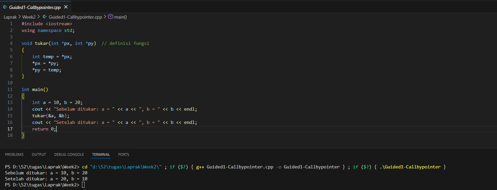
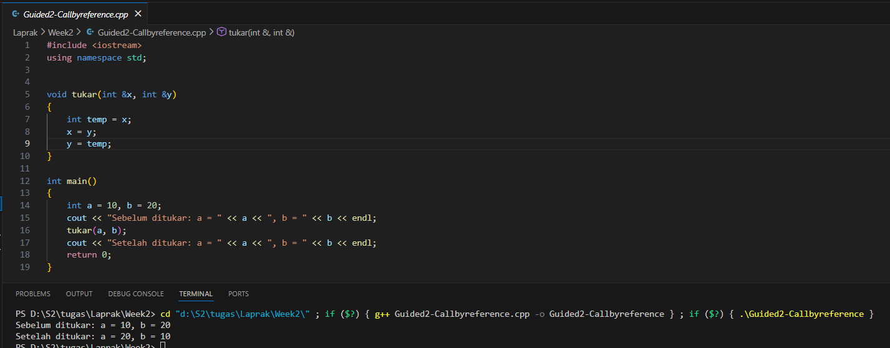
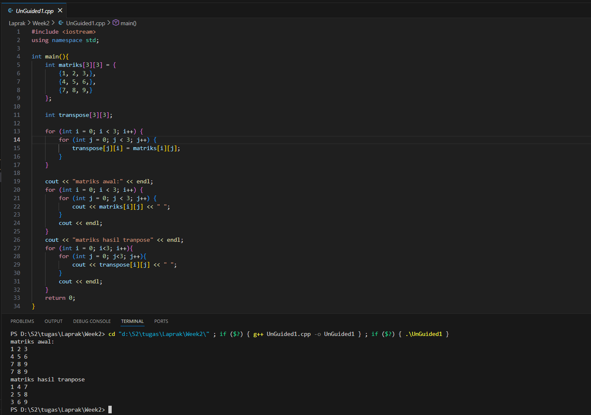
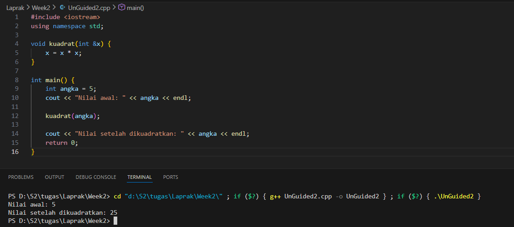

# <h1 align="center">Laporan Praktikum Modul X <br> Nama Modul</h1>
#### <p align="center"> Luthfi Maolana Andhika W - 103112430181 </p>

## Dasar Teori

Materi ini membahas array, pointer, fungsi, dan prosedur dalam C++. Array adalah struktur data untuk menyimpan banyak nilai dalam satu wadah dengan indeks sebagai pengaksesnya. Pointer adalah variabel yang menyimpan alamat dari variabel lain, termasuk elemen array. Fungsi adalah sub-program yang dapat digunakan kembali dan dapat menerima input serta menghasilkan output, seperti fungsi main(). Jika fungsi tidak memiliki input, sering disebut sebagai prosedur.

## Guided

### Soal 1 - Call By Pointer

```go
#include <iostream>
using namespace std;

void tukar(int *px, int *py)  // definisi fungsi
{
    int temp = *px;
    *px = *py;
    *py = temp;
}

int main()
{
    int a = 10, b = 20;
    cout << "Sebelum ditukar: a = " << a << ", b = " << b << endl;
    tukar(&a, &b);
    cout << "Setelah ditukar: a = " << a << ", b = " << b << endl;
    return 0;
}
```

> Output
> 

Program tersebut menggunakan pointer sebagai parameter untuk menukar nilai dua variabel. Fungsi menerima *px dan *py sebagai alamat a dan b, lalu menggunakan temp untuk menukarnya. Di main, tukar(&a, &b) dipanggil agar nilai asli a dan b berubah, sehingga hasilnya tertukar.

### Soal 2 - Call By Reference

```go
#include <iostream>
using namespace std;


void tukar(int &x, int &y)
{
    int temp = x;
    x = y;
    y = temp;
}

int main()
{
    int a = 10, b = 20;
    cout << "Sebelum ditukar: a = " << a << ", b = " << b << endl;
    tukar(a, b);
    cout << "Setelah ditukar: a = " << a << ", b = " << b << endl;
    return 0;
}
```

> Output
> 

Program ini mirip dengan sebelumnya, tetapi menggunakan reference. Pada fungsi tukar(int &x, int &y), tanda & berarti variabel tersebut adalah referensi ke nilai asli, sehingga perubahan langsung mengubah variabel aslinya. Cara ini membuat pemanggilan lebih sederhana dibanding pointer.

## Unguided

### Soal 1

```go
#include <iostream>
using namespace std;

int main(){
    int matriks[3][3] = {
        {1, 2, 3,},
        {4, 5, 6,},
        {7, 8, 9,}
    };

    int transpose[3][3];

    for (int i = 0; i < 3; i++) {
        for (int j = 0; j < 3; j++) {
            transpose[j][i] = matriks[i][j];  
        }
    }

    cout << "matriks awal:" << endl;
    for (int i = 0; i < 3; i++) {
        for (int j = 0; j < 3; j++) {
            cout << matriks[i][j] << " ";
        }
        cout << endl;
    }
    cout << "matriks hasil tranpose" << endl;
    for (int i = 0; i<3; i++){
        for (int j = 0; j<3; j++){
            cout << transpose[i][j] << " ";
        }
        cout << endl;
    }
    return 0;
}
```

> Output
> 

Program tersebut melakukan transpose matriks 3×3. Pertama, matriks awal diinisiasi, kemudian dibuat matriks kosong untuk menampung hasil transpose. Dua loop digunakan untuk menukar baris menjadi kolom. Setelah itu, program mencetak matriks awal dan matriks hasil transpose menggunakan dua loop untuk setiap baris.

### Soal 2

```go
#include <iostream>
using namespace std;

void kuadrat(int &x) {
    x = x * x; 
}

int main() {
    int angka = 5; 
    cout << "Nilai awal: " << angka << endl;

    kuadrat(angka); 

    cout << "Nilai setelah dikuadratkan: " << angka << endl;
    return 0;
}
```

> Output
> 

penjelasan kode

Program tersebut menggunakan call by reference untuk mengkuadratkan sebuah bilangan. Nilai awal angka = 5, lalu prosedur kuadrat(&x) melakukan x = x * x. Output pertama menampilkan nilai awal, dan setelah prosedur dipanggil, output kedua menampilkan nilai yang sudah dikuadratkan.


## Referensi

1. https://www.programiz.com/cpp-programming/pointers-arrays (diakses 26/11/26)
