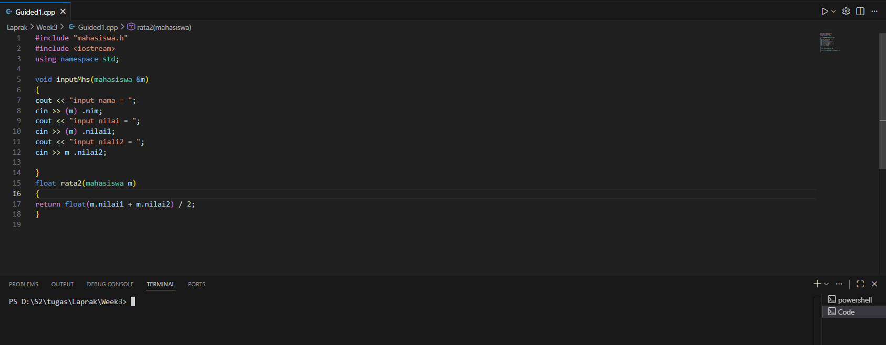
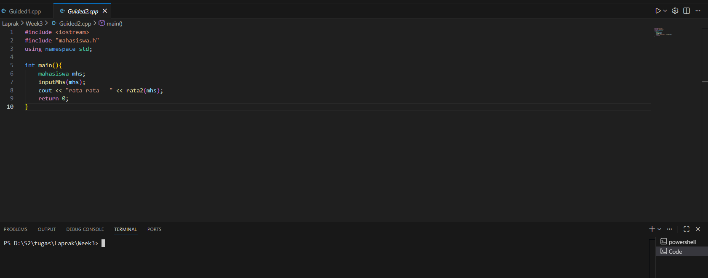
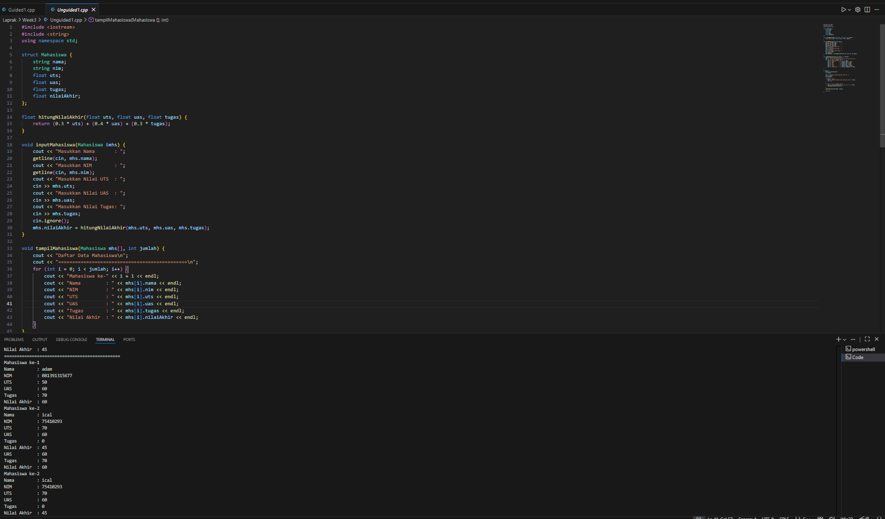
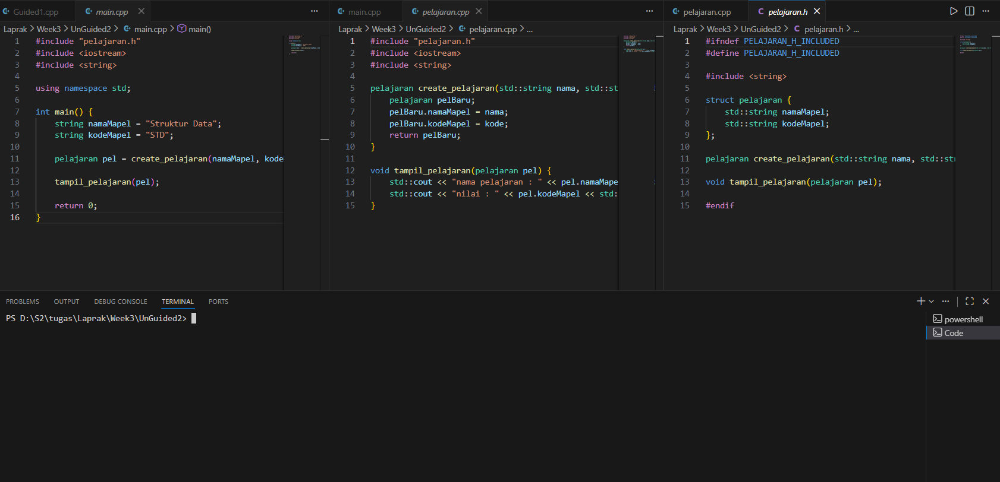
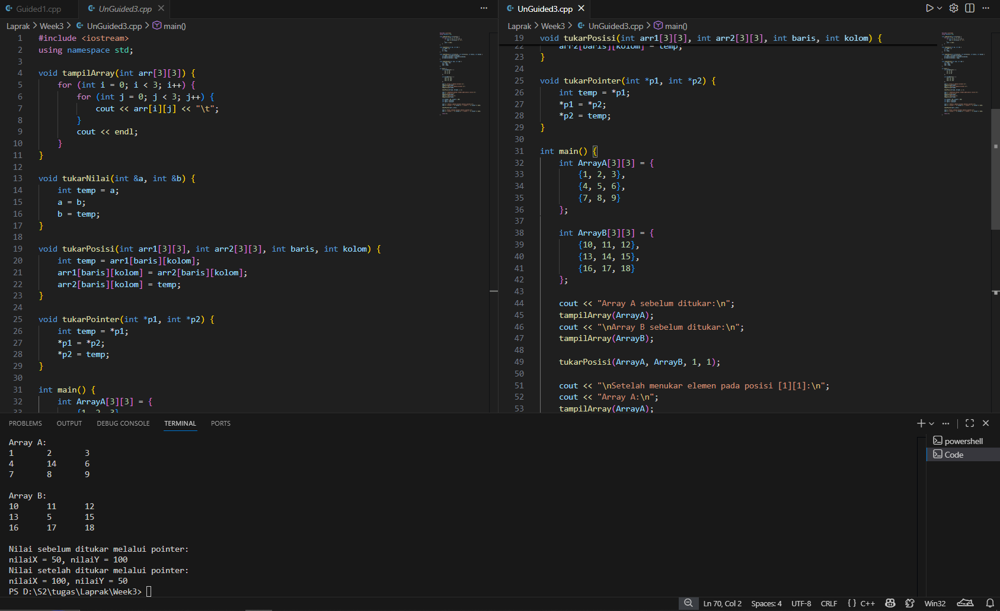

# <h1 align="center">Laporan Praktikum Modul X <br> ABSTARCT DATA TYPE</h1>
<p align="center"> Luthfi Maolana Andhika W - 103112430181 </p>

## Dasar Teori

Abstract data type adalah sebuah model dari tipe data yang ditentukan dalam sudut pandang pengguna. adt menjelaskan apa yang dilakukan oleh tipe data. Komponen utama ADT ada dua yaitu data yang akan disimpan dan operasinya. Contoh ADT umum adalah Stack(pop,peek,isEmpty,isFull), Queue, List, Tree, Map/Dictionary

## Guided

### soal 1

File MAHASISWA_H_INCLUDED berfungsi sebagai kontrak (interface) untuk modul mahasiswa dalam program C++, dilindungi oleh header guard untuk mencegah pendefinisian ganda. File ini mendefinisikan struktur data mahasiswa yang terdiri dari NIM (char nim[10]), dan dua nilai integer (nilai1 dan nilai2). Selain struktur, file ini mendeklarasikan dua prototipe fungsi: void inputMhs(mahasiswa &m) yang memungkinkan pengguna mengisi data mahasiswa (menggunakan referensi untuk memodifikasi objek), dan float rata2(mahasiswa m) yang bertugas menghitung dan mengembalikan hasil rata-rata dari kedua nilai tersebut dalam tipe data floating point.

```go
#ifndef MAHASISWA_H_INCLUDED
#define MAHASISWA_H_INCLUDED

struct mahasiswa
{
 char nim[10];
 int nilai1, nilai2;
};

void inputMhs(mahasiswa &m);
float rata2(mahasiswa m);

#endif

////////////////////////////////////////////////////////////////////////////////////////////////////////

#include "mahasiswa.h"
#include <iostream>
using namespace std;

void inputMhs(mahasiswa &m)
{
cout << "input nama = ";
cin >> (m) .nim;
cout << "input nilai = ";
cin >> (m) .nilai1;
cout << "input niali2 = ";
cin >> m .nilai2;

}
float rata2(mahasiswa m)
{
return float(m.nilai1 + m.nilai2) / 2;
}

```

> Output
> 

Pada program diatas kita disuruh untuk membuat ADT berupa inputMhs yang menerima inputan berupa nim,nilai1 dan nilai2, lalu mengembalikan nilai rerata yang diinputkan


### soal 1

File MAHASISWA_H_INCLUDED berfungsi sebagai kontrak (interface) untuk modul mahasiswa dalam program C++, dilindungi oleh header guard untuk mencegah pendefinisian ganda. File ini mendefinisikan struktur data mahasiswa yang terdiri dari NIM (char nim[10]), dan dua nilai integer (nilai1 dan nilai2). Selain struktur, file ini mendeklarasikan dua prototipe fungsi: void inputMhs(mahasiswa &m) yang memungkinkan pengguna mengisi data mahasiswa (menggunakan referensi untuk memodifikasi objek), dan float rata2(mahasiswa m) yang bertugas menghitung dan mengembalikan hasil rata-rata dari kedua nilai tersebut dalam tipe data floating point.

```go
#include <iostream>
#include "mahasiswa.h"
using namespace std;

int main(){
    mahasiswa mhs;
    inputMhs(mhs);
    cout << "rata rata = " << rata2(mhs);
    return 0;
}

```

> Output
> 

Pada program diatas kita membuat fungsi main untuk mengeluarkan output dari nilai rerata yang telah diinputkan


## Unguided

### Soal 1

```go
#include <iostream>
#include <string>
using namespace std;

struct Mahasiswa {
    string nama;
    string nim;
    float uts;
    float uas;
    float tugas;
    float nilaiAkhir;
};

float hitungNilaiAkhir(float uts, float uas, float tugas) {
    return (0.3 * uts) + (0.4 * uas) + (0.3 * tugas);
}

void inputMahasiswa(Mahasiswa &mhs) {
    cout << "Masukkan Nama       : ";
    getline(cin, mhs.nama);
    cout << "Masukkan NIM        : ";
    getline(cin, mhs.nim);
    cout << "Masukkan Nilai UTS  : ";
    cin >> mhs.uts;
    cout << "Masukkan Nilai UAS  : ";
    cin >> mhs.uas;
    cout << "Masukkan Nilai Tugas: ";
    cin >> mhs.tugas;
    cin.ignore();
    mhs.nilaiAkhir = hitungNilaiAkhir(mhs.uts, mhs.uas, mhs.tugas);
}

void tampilMahasiswa(Mahasiswa mhs[], int jumlah) {
    cout << "Daftar Data Mahasiswa\n";
    cout << "==============================================\n";
    for (int i = 0; i < jumlah; i++) {
        cout << "Mahasiswa ke-" << i + 1 << endl;
        cout << "Nama         : " << mhs[i].nama << endl;
        cout << "NIM          : " << mhs[i].nim << endl;
        cout << "UTS          : " << mhs[i].uts << endl;
        cout << "UAS          : " << mhs[i].uas << endl;
        cout << "Tugas        : " << mhs[i].tugas << endl;
        cout << "Nilai Akhir  : " << mhs[i].nilaiAkhir << endl;
    }
}

int main() {
    Mahasiswa daftarMhs[10];
    int jumlah;

    cout << "Masukkan jumlah mahasiswa (max 10): ";
    cin >> jumlah;
    cin.ignore();

    if (jumlah > 10) {
        cout << "Jumlah melebihi batas maksimum (10)!" << endl;
        return 0;
    }

    for (int i = 0; i < jumlah; i++) {
        cout << "\nInput data mahasiswa ke-" << i + 1 << endl;
        inputMahasiswa(daftarMhs[i]);
    }

    tampilMahasiswa(daftarMhs, jumlah);

    return 0;
}
```

> Output
> 

Pada program tersebut kita membuat sebuah ADT untuk menampilkan data mahasiswa yang kita input. Kita mendefinisikan sebuah struct yang berisi data mahasiswa yang akan disimpan. Setelah itu, kita membuat beberapa fungsi seperti hitungNilaiAkhir, inputMahasiswa, dan tampilMahasiswa. Pada fungsi main, kita memasukkan jumlah mahasiswa beserta datanya, kemudian program menampilkan daftar data mahasiswa yang telah diinputkan.
### Soal 2

```go
#ifndef PELAJARAN_H_INCLUDED
#define PELAJARAN_H_INCLUDED

#include <string>

struct pelajaran {
    std::string namaMapel; 
    std::string kodeMapel; 
};

pelajaran create_pelajaran(std::string nama, std::string kode);

void tampil_pelajaran(pelajaran pel);

#endif

/////////////////////////////////////////////////////////////

#include "pelajaran.h"
#include <iostream>
#include <string>

pelajaran create_pelajaran(std::string nama, std::string kode) {
    pelajaran pelBaru;
    pelBaru.namaMapel = nama;
    pelBaru.kodeMapel = kode;
    return pelBaru;
}

void tampil_pelajaran(pelajaran pel) {
    std::cout << "nama pelajaran : " << pel.namaMapel << std::endl;
    std::cout << "nilai : " << pel.kodeMapel << std::endl; 
}

//////////////////////////////////////////////////////////////

#include "pelajaran.h"
#include <iostream>
#include <string>

using namespace std;

int main() {
    string namaMapel = "Struktur Data";
    string kodeMapel = "STD";
    
    pelajaran pel = create_pelajaran(namaMapel, kodeMapel);
    
    tampil_pelajaran(pel);

    return 0;
}
```

> Output
> 

Pada program tersebut, kita membuat sebuah ADT untuk daftar mata pelajaran dengan menggunakan struct Pelajaran yang didefinisikan pada file pelajaran.h, serta fungsi tampilPelajaran yang diimplementasikan pada file pelajaran.cpp. Kemudian, fungsi main digunakan untuk mengeksekusi dan memanfaatkan ADT tersebut.
Kalau adalanjutan di lanjut disini aja

### Soal 3

```go
#include <iostream>
using namespace std;

void tampilArray(int arr[3][3]) {
    for (int i = 0; i < 3; i++) {
        for (int j = 0; j < 3; j++) {
            cout << arr[i][j] << "\t";
        }
        cout << endl;
    }
}

void tukarNilai(int &a, int &b) {
    int temp = a;
    a = b;
    b = temp;
}

void tukarPosisi(int arr1[3][3], int arr2[3][3], int baris, int kolom) {
    int temp = arr1[baris][kolom];
    arr1[baris][kolom] = arr2[baris][kolom];
    arr2[baris][kolom] = temp;
}

void tukarPointer(int *p1, int *p2) {
    int temp = *p1;
    *p1 = *p2;
    *p2 = temp;
}

int main() {
    int ArrayA[3][3] = {
        {1, 2, 3},
        {4, 5, 6},
        {7, 8, 9}
    };

    int ArrayB[3][3] = {
        {10, 11, 12},
        {13, 14, 15},
        {16, 17, 18}
    };

    cout << "Array A sebelum ditukar:\n";
    tampilArray(ArrayA);
    cout << "\nArray B sebelum ditukar:\n";
    tampilArray(ArrayB);

    tukarPosisi(ArrayA, ArrayB, 1, 1);

    cout << "\nSetelah menukar elemen pada posisi [1][1]:\n";
    cout << "Array A:\n";
    tampilArray(ArrayA);
    cout << "\nArray B:\n";
    tampilArray(ArrayB);

    int nilaiX = 50, nilaiY = 100;
    int *ptr1 = &nilaiX;
    int *ptr2 = &nilaiY;

    cout << "\nNilai sebelum ditukar melalui pointer:\n";
    cout << "nilaiX = " << nilaiX << ", nilaiY = " << nilaiY << endl;

    tukarPointer(ptr1, ptr2);

    cout << "Nilai setelah ditukar melalui pointer:\n";
    cout << "nilaiX = " << nilaiX << ", nilaiY = " << nilaiY << endl;

    return 0;
}
```

> Output
> 

Pada program tersebut, kita membuat sebuah ADT untuk melakukan operasi penukaran pada sebuah array. Kita mendefinisikan beberapa fungsi, yaitu tampilArray, tukarNilai, tukarPosisi, dan tukarPointer. Pada fungsi main, kita menggunakan data dummy sebagai isi array, kemudian menampilkan array sebelum dan sesudah proses penukaran dilakukan.

## Referensi

1. https://www.w3schools.com (diakses 8 Desember 2025)
