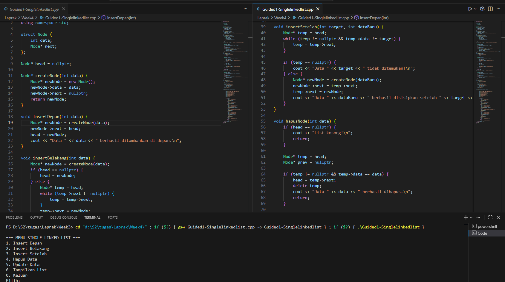
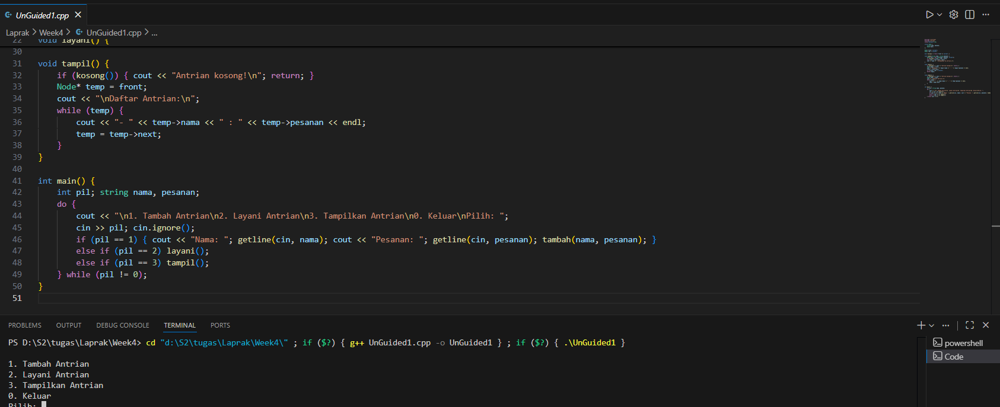

# <h1 align="center">Laporan Praktikum Modul X <br> SINGLE LINKED LIST</h1>
<p align="center"> Luthfi Maolana Andhika W - 103112430181 </p>

## Dasar Teori

Intinya pada single linked list itu merupakan struktur data fundamentalyang memiliki element yang dihubungkan secara berurutan. Terdapat tiga komponen utama dari single linked list, yaitu Node(berfungsi untuk menyimpan sebuah data), Head(berfungsi untuk node pertama), Tail atau NULL atau none(penunjuk ke node selanjutnya atau NULL)

## Guided

### Soal 1

copy paste soal nomor 1 disini

```go
#include <iostream>
using namespace std;

struct Node {
    int data;
    Node* next;
};

Node* head = nullptr;

Node* createNode(int data) {
    Node* newNode = new Node();
    newNode->data = data;
    newNode->next = nullptr;
    return newNode;
}

void insertDepan(int data) {
    Node* newNode = createNode(data);
    newNode->next = head;
    head = newNode;
    cout << "Data " << data << " berhasil ditambahkan di depan.\n";
}

void insertBelakang(int data) {
    Node* newNode = createNode(data);
    if (head == nullptr) {
        head = newNode;
    } else {
        Node* temp = head;
        while (temp->next != nullptr) {
            temp = temp->next;
        }
        temp->next = newNode;
    }
    cout << "Data " << data << " berhasil ditambahkan di belakang.\n";
}

void insertSetelah(int target, int dataBaru) {
    Node* temp = head;
    while (temp != nullptr && temp->data != target) {
        temp = temp->next;
    }

    if (temp == nullptr) {
        cout << "Data " << target << " tidak ditemukan!\n";
    } else {
        Node* newNode = createNode(dataBaru);
        newNode->next = temp->next;
        temp->next = newNode;
        cout << "Data " << dataBaru << " berhasil disisipkan setelah " << target << ".\n";
    }
}

void hapusNode(int data) {
    if (head == nullptr) {
        cout << "List kosong!\n";
        return;
    }

    Node* temp = head;
    Node* prev = nullptr;

    if (temp != nullptr && temp->data == data) {
        head = temp->next;
        delete temp;
        cout << "Data " << data << " berhasil dihapus.\n";
        return;
    }

    while (temp != nullptr && temp->data != data) {
        prev = temp;
        temp = temp->next;
    }

    if (temp == nullptr) {
        cout << "Data " << data << " tidak ditemukan!\n";
        return;
    }

    prev->next = temp->next;
    delete temp;
    cout << "Data " << data << " berhasil dihapus.\n";
}

void updateNode(int dataLama, int dataBaru) {
    Node* temp = head;
    while (temp != nullptr && temp->data != dataLama) {
        temp = temp->next;
    }

    if (temp == nullptr) {
        cout << "Data " << dataLama << " tidak ditemukan!\n";
    } else {
        temp->data = dataBaru;
        cout << "Data " << dataLama << " berhasil diupdate menjadi " << dataBaru << ".\n";
    }
}

void tampilkanList() {
    if (head == nullptr) {
        cout << "List kosong!\n";
        return;
    }

    Node* temp = head;
    cout << "Isi Linked List: ";
    while (temp != nullptr) {
        cout << temp->data << " -> ";
        temp = temp->next;
    }
    cout << "NULL\n";
}

int main() {
    int pilihan, data, target, dataBaru;

    do {
        cout << "\n=== MENU SINGLE LINKED LIST ===\n";
        cout << "1. Insert Depan\n";
        cout << "2. Insert Belakang\n";
        cout << "3. Insert Setelah\n";
        cout << "4. Hapus Data\n";
        cout << "5. Update Data\n";
        cout << "6. Tampilkan List\n";
        cout << "0. Keluar\n";
        cout << "Pilih: ";
        cin >> pilihan;

        switch (pilihan) {
            case 1:
                cout << "Masukkan data: ";
                cin >> data;
                insertDepan(data);
                break;
            case 2:
                cout << "Masukkan data: ";
                cin >> data;
                insertBelakang(data);
                break;
            case 3:
                cout << "Masukkan data target: ";
                cin >> target;
                cout << "Masukkan data baru: ";
                cin >> dataBaru;
                insertSetelah(target, dataBaru);
                break;
            case 4:
                cout << "Masukkan data yang ingin dihapus: ";
                cin >> data;
                hapusNode(data);
                break;
            case 5:
                cout << "Masukkan data lama: ";
                cin >> data;
                cout << "Masukkan data baru: ";
                cin >> dataBaru;
                updateNode(data, dataBaru);
                break;
            case 6:
                tampilkanList();
                break;
            case 0:
                cout << "Program selesai.\n";
                break;
            default:
                cout << "Pilihan tidak valid!\n";
        }
    } while (pilihan != 0);

return 0;
}
```

> Output
> 

Pada program tersebut, kita diminta membuat sebuah list dengan beberapa operasi menggunakan singly linked list. Kita membuat sebuah struct yang berisi data yang akan disimpan serta pointer menuju node berikutnya. Kemudian, kita mengimplementasikan fungsi insert depan, insert belakang, dan insert setelah. Fungsi insert setelah digunakan untuk menambahkan data baru tepat setelah data tertentu yang dipilih. Selain itu, kita juga membuat fungsi hapus, update, dan tampilkan list; fungsi update digunakan untuk mengganti data pada node yang dipilih dengan data yang baru.

Pada fungsi main, kita menggunakan struktur switch-case dengan pilihan 1–6 untuk menjalankan fungsi-fungsi yang telah dibuat, serta pilihan 0 untuk mengakhiri program.

## Unguided

### Soal 1

buatlah single linked list untuk Antrian yang menyimpan data pembeli( nama dan pesanan). program memiliki beberapa menu seperti tambah antrian, layani antrian(hapus), dan tampilkan antrian. *antrian pertama harus yang pertama dilayani

```go
#include <iostream>
#include <string>
using namespace std;

struct Node {
    string nama, pesanan;
    Node* next;
};

Node* front = nullptr;
Node* rear = nullptr;

bool kosong() { return front == nullptr; }

void tambah(string nama, string pesanan) {
    Node* baru = new Node{nama, pesanan, nullptr};
    if (kosong()) front = rear = baru;
    else rear = rear->next = baru;
    cout << nama << " ditambahkan ke antrian.\n";
}

void layani() {
    if (kosong()) { cout << "Antrian kosong!\n"; return; }
    Node* hapus = front;
    cout << "Melayani " << hapus->nama << " - " << hapus->pesanan << endl;
    front = front->next;
    if (!front) rear = nullptr;
    delete hapus;
}

void tampil() {
    if (kosong()) { cout << "Antrian kosong!\n"; return; }
    Node* temp = front;
    cout << "\nDaftar Antrian:\n";
    while (temp) {
        cout << "- " << temp->nama << " : " << temp->pesanan << endl;
        temp = temp->next;
    }
}

int main() {
    int pil; string nama, pesanan;
    do {
        cout << "\n1. Tambah Antrian\n2. Layani Antrian\n3. Tampilkan Antrian\n0. Keluar\nPilih: ";
        cin >> pil; cin.ignore();
        if (pil == 1) { cout << "Nama: "; getline(cin, nama); cout << "Pesanan: "; getline(cin, pesanan); tambah(nama, pesanan); }
        else if (pil == 2) layani();
        else if (pil == 3) tampil();
    } while (pil != 0);
}

```

> 

Pada program tersebut, kita membuat sebuah list dengan beberapa operasi menggunakan single linked list. Kita mendefinisikan sebuah struct yang menyimpan data berupa string untuk nama dan pesanan, serta pointer ke node berikutnya. Program ini menggunakan library <string>, dan class Antrian dibuat sebagai public agar dapat diakses oleh fungsi main.

Selanjutnya, kita membuat fungsi tambahAntrian, layaniAntrian, dan tampilkanAntrian. Pada fungsi main, digunakan struktur switch-case untuk memilih dan menjalankan fungsi antrian yang diinginkan.
### Soal 2

buatlah program kode untuk membalik (reverse) singly linked list (1-2-3 menjadi 3-2-1)


```go
#include <iostream>
using namespace std;

struct Node {
    int data;
    Node* next;
};

Node* head = nullptr;

void tambahBelakang(int data) {
    Node* baru = new Node{data, nullptr};
    if (head == nullptr)
        head = baru;
    else {
        Node* temp = head;
        while (temp->next != nullptr)
            temp = temp->next;
        temp->next = baru;
    }
}

void tampil() {
    if (head == nullptr) {
        cout << "List kosong!\n";
        return;
    }
    Node* temp = head;
    while (temp != nullptr) {
        cout << temp->data << " -> ";
        temp = temp->next;
    }
    cout << "NULL\n";
}

void balikList() {
    Node *prev = nullptr, *curr = head, *next = nullptr;
    while (curr != nullptr) {
        next = curr->next;
        curr->next = prev;
        prev = curr;
        curr = next;
    }
    head = prev;
    cout << "Linked list berhasil dibalik!\n";
}

int main() {
    int n, data;

    cout << "Masukkan jumlah elemen linked list: ";
    cin >> n;

    for (int i = 0; i < n; i++) {
        cout << "Masukkan data ke-" << i + 1 << ": ";
        cin >> data;
        tambahBelakang(data);
    }

    cout << "\nLinked list sebelum dibalik:\n";
    tampil();

    balikList();

    cout << "\nLinked list setelah dibalik:\n";
    tampil();

    return 0;
}

```

> 

Pada program tersebut, kita membuat sebuah program untuk membalik urutan angka menggunakan single linked list. Kita mendefinisikan sebuah struct yang berisi data bertipe int serta pointer ke node berikutnya. Program ini memiliki fungsi tambahData, tampilkan, dan reverse yang berfungsi untuk membalik urutan list.

Di dalam fungsi main, kita menggunakan data dummy sebagai isi list, kemudian program menampilkan urutan angka sebelum dibalik dan setelah dibalik.

## Referensi

1. https://www.w3schools.com (diakses 8 Desember 2025)
