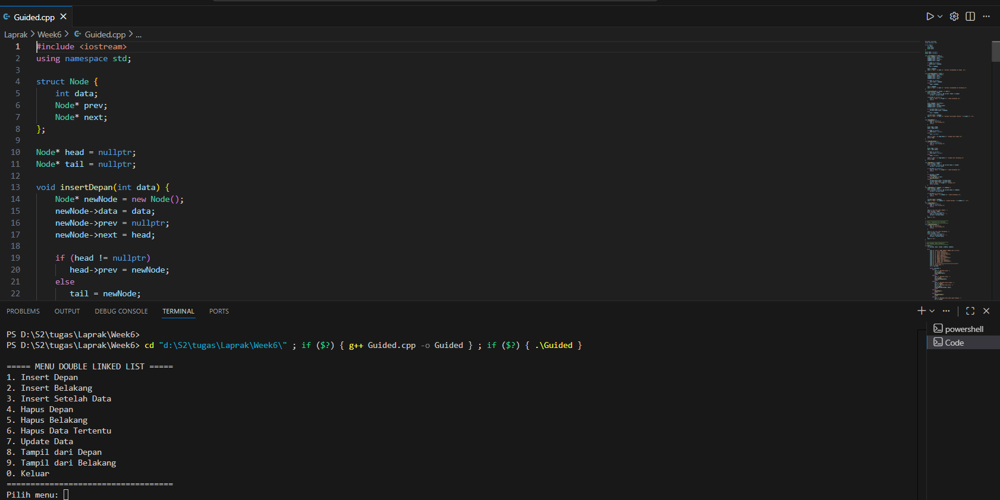
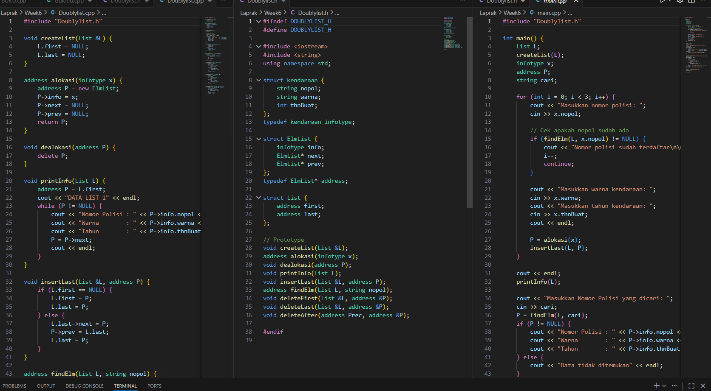

# <h1 align="center">Laporan Praktikum Modul 6 <br> Double Linked List</h1>
<p align="center"> Luthfi Maolana Andhika W - 103112430181 </p>

## Dasar Teori

Doubly Linked List adalah struktur data yang terdiri dari rangkaian node. Setiap node punya tiga bagian: pointer ke node sebelumnya (prev), data (info), dan pointer ke node berikutnya (next). Tidak seperti Singly Linked List yang hanya bisa dibaca satu arah, Doubly Linked List bisa ditelusuri maju dan mundur. Struktur ini memudahkan penambahan dan penghapusan data di posisi mana pun tanpa harus menggeser elemen seperti pada array. Kekurangannya, ia memakai memori lebih banyak dan lebih rumit dibuat. Doubly Linked List sering dipakai pada fitur yang butuh navigasi dua arah, seperti riwayat browser atau undo-redo aplikasi.

## Guided

### Soal 1

```go
#include <iostream>
using namespace std;

struct Node {
    int data;
    Node* prev;
    Node* next;
};

Node* head = nullptr;
Node* tail = nullptr;

void insertDepan(int data) {
    Node* newNode = new Node();
    newNode->data = data;
    newNode->prev = nullptr;
    newNode->next = head;

    if (head != nullptr)
       head->prev = newNode;
    else
       tail = newNode;

    head = newNode;
    cout << "Data " << data << " berhasil ditambahkan di depan. \n";
}

void insertBelakang(int data) {
    Node* newNode = new Node();
    newNode->data = data;
    newNode->next = nullptr;
    newNode->prev = tail;

    if (tail != nullptr)
        tail->next = newNode;
    else
        head = newNode;

    tail = newNode;
    cout << "Data " << data << " berhasil ditambahkan di belakang.\n";
}

void insertSetelah(int target, int data) {
    Node* current = head;
    while (current != nullptr && current ->data != target)
        current = current->next;

    if(current == nullptr) {
        cout << "Data " << target << " tidak ditemukan.\n";
        return;
    }

    Node* newNode = new Node();
    newNode->data = data;
    newNode->next = current->next;
    newNode->prev = current;

    if (current->next != nullptr)
        current->next->prev = newNode;
    else
        tail = newNode;

    current->next = newNode;
    cout << "Data " << data << " berhasil disisipkan setelah " << target << ".\n";
}

void hapusDepan() {
    if (head == nullptr) {
        cout << "List kosong.\n";
        return;
    }

    Node* temp = head;
    head = head->next;

    if (head != nullptr)
        head->prev = nullptr;
    else
        tail = nullptr;

    cout << "Data " << temp->data << " dihapus dari depan.\n";
    delete temp;
}

void hapusBelakang() {
    if  (tail == nullptr) {
        cout << "List kosong.\n";
        return;
    }

    Node* temp = tail;
    tail = tail->prev;

    if (tail != nullptr)
        tail->next = nullptr;
    else
        head = nullptr;
    
    cout << "Data " << temp->data << " dihapus dari belakang.\n";
    delete temp;
}

void hapusData(int target) {
    Node* current = head;
    while (current != nullptr && current->data != target)
        current = current->next;

    if (current == nullptr) {
        cout << "Data " << target << " tidak ditemukan.\n";
        return;
    }

    if (current == head)
        hapusDepan();
    else if (current == tail)
        hapusBelakang();
    else {
        current->prev->next = current->next;
        current->next->prev = current->prev;
        cout << "Data " << target << " dihapus.\n";
        delete current;
    }
}
void updateData(int oldData, int newData) {
    Node* current = head;
    while (current != nullptr && current->data != oldData)
        current = current->next;

    if (current == nullptr) {
        cout << "Data " << oldData << " tidak ditemukan.\n";
        return;
    }

    current->data = newData;
    cout << "Data " << oldData << " diubah menjadi " << newData << ".\n";
}
void tampilDepan() {
    if (head == nullptr) {
        cout << "List kosong.\n";
        return;
    }

    cout << "Isi list (dari depan): ";
    Node* current = head;
    while (current != nullptr) {
        cout << current->data << " ";
        current = current->next;
    }
    cout << "\n";
}

// ====================================
// Fungsi: Tampilkan dari belakang
// ====================================
void tampilBelakang() {
    if (tail == nullptr) {
        cout << "List kosong.\n";
        return;
    }

    cout << "Isi list (dari belakang): ";
    Node* current = tail;
    while (current != nullptr) {
        cout << current->data << " ";
        current = current->prev;
    }
    cout << "\n";
}

// ====================================
// MAIN PROGRAM (MENU INTERAKTIF)
// ====================================
int main() {
    int pilihan, data, target, oldData, newData;

    do {
        cout << "\n===== MENU DOUBLE LINKED LIST =====\n";
        cout << "1. Insert Depan\n";
        cout << "2. Insert Belakang\n";
        cout << "3. Insert Setelah Data\n";
        cout << "4. Hapus Depan\n";
        cout << "5. Hapus Belakang\n";
        cout << "6. Hapus Data Tertentu\n";
        cout << "7. Update Data\n";
        cout << "8. Tampil dari Depan\n";
        cout << "9. Tampil dari Belakang\n";
        cout << "0. Keluar\n";
        cout << "===================================\n";
        cout << "Pilih menu: ";
        cin >> pilihan;

        switch (pilihan) {
            case 1:
                cout << "Masukkan data: ";
                cin >> data;
                insertDepan(data);
                break;
            case 2:
                cout << "Masukkan data: ";
                cin >> data;
                insertBelakang(data);
                break;
            case 3:
                cout << "Masukkan data target: ";
                cin >> target;
                cout << "Masukkan data baru: ";
                cin >> data;
                insertSetelah(target, data);
                break;
            case 4:
                hapusDepan();
                break;
            case 5:
                hapusBelakang();
                break;
            case 6:
                cout << "Masukkan data yang ingin dihapus: ";
                cin >> target;
                hapusData(target);
                break;
            case 7:
                cout << "Masukkan data lama: ";
                cin >> oldData;
                cout << "Masukkan data baru: ";
                cin >> newData;
                updateData(oldData, newData);
                break;
            case 8:
                tampilDepan();
                break;
            case 9:
                tampilBelakang();
                break;
            case 0:
                cout << "👋 Keluar dari program.\n";
                break;
            default:
                cout << "Pilihan tidak valid.\n";
        }

    } while (pilihan != 0);

    return 0;
}
```

> 


## Unguided

### Soal 1
DoubleLinkedList.cpp
```go
#include "Doublylist.h"

void createList(List &L) {
    L.first = NULL;
    L.last = NULL;
}

address alokasi(infotype x) {
    address P = new ElmList;
    P->info = x;
    P->next = NULL;
    P->prev = NULL;
    return P;
}

void dealokasi(address P) {
    delete P;
}

void printInfo(List L) {
    address P = L.first;
    cout << "DATA LIST 1" << endl;
    while (P != NULL) {
        cout << "Nomor Polisi : " << P->info.nopol << endl;
        cout << "Warna        : " << P->info.warna << endl;
        cout << "Tahun        : " << P->info.thnBuat << endl;
        P = P->next;
        cout << endl;
    }
}

void insertLast(List &L, address P) {
    if (L.first == NULL) {
        L.first = P;
        L.last = P;
    } else {
        L.last->next = P;
        P->prev = L.last;
        L.last = P;
    }
}

address findElm(List L, string nopol) {
    address P = L.first;
    while (P != NULL) {
        if (P->info.nopol == nopol) {
            return P;
        }
        P = P->next;
    }
    return NULL;
}

void deleteFirst(List &L, address &P) {
    if (L.first != NULL) {
        P = L.first;
        if (L.first == L.last) {
            L.first = NULL;
            L.last = NULL;
        } else {
            L.first = P->next;
            L.first->prev = NULL;
        }
        P->next = NULL;
    }
}

void deleteLast(List &L, address &P) {
    if (L.first != NULL) {
        P = L.last;
        if (L.first == L.last) {
            L.first = NULL;
            L.last = NULL;
        } else {
            L.last = P->prev;
            L.last->next = NULL;
        }
        P->prev = NULL;
    }
}

void deleteAfter(address Prec, address &P) {
    if (Prec != NULL && Prec->next != NULL) {
        P = Prec->next;
        Prec->next = P->next;
        if (P->next != NULL) {
            P->next->prev = Prec;
        }
        P->next = NULL;
        P->prev = NULL;
    }
}

```

Doublelinkedlist.h
```go
#ifndef DOUBLYLIST_H
#define DOUBLYLIST_H

#include <iostream>
#include <string>
using namespace std;

struct kendaraan {
    string nopol;
    string warna;
    int thnBuat;
};
typedef kendaraan infotype;

struct ElmList {
    infotype info;
    ElmList* next;
    ElmList* prev;
};
typedef ElmList* address;

struct List {
    address first;
    address last;
};

// Prototype
void createList(List &L);
address alokasi(infotype x);
void dealokasi(address P);
void printInfo(List L);
void insertLast(List &L, address P);
address findElm(List L, string nopol);
void deleteFirst(List &L, address &P);
void deleteLast(List &L, address &P);
void deleteAfter(address Prec, address &P);

#endif

```

main.cpp
```go
#include "Doublylist.h"

int main() {
    List L;
    createList(L);
    infotype x;
    address P;
    string cari;

    for (int i = 0; i < 3; i++) {
        cout << "Masukkan nomor polisi: ";
        cin >> x.nopol;

        // Cek apakah nopol sudah ada
        if (findElm(L, x.nopol) != NULL) {
            cout << "Nomor polisi sudah terdaftar\n\n";
            i--;
            continue;
        }

        cout << "Masukkan warna kendaraan: ";
        cin >> x.warna;
        cout << "Masukkan tahun kendaraan: ";
        cin >> x.thnBuat;
        cout << endl;

        P = alokasi(x);
        insertLast(L, P);
    }

    cout << endl;
    printInfo(L);

    cout << "Masukkan Nomor Polisi yang dicari: ";
    cin >> cari;
    P = findElm(L, cari);
    if (P != NULL) {
        cout << "Nomor Polisi : " << P->info.nopol << endl;
        cout << "Warna        : " << P->info.warna << endl;
        cout << "Tahun        : " << P->info.thnBuat << endl;
    } else {
        cout << "Data tidak ditemukan" << endl;
    }

    // Contoh delete D003
    cout << "\nMasukkan Nomor Polisi yang akan dihapus : ";
    cin >> cari;
    P = findElm(L, cari);
    if (P != NULL) {
        if (P == L.first) {
            deleteFirst(L, P);
        } else if (P == L.last) {
            deleteLast(L, P);
        } else {
            deleteAfter(P->prev, P);
        }
        cout << "Data dengan nomor polisi " << cari << " berhasil dihapus.\n";
    } else {
        cout << "Data tidak ditemukan.\n";
    }

    cout << "\nSetelah dihapus:\n";
    printInfo(L);

    return 0;
}

```

> 


Program ini terdiri dari tiga file utama. Doublylist.h berisi deklarasi struktur dan fungsi ADT Doubly Linked List. Doublylist.cpp mengimplementasikan fungsi-fungsinya, seperti membuat list, menambah, mencari, menghapus, dan menampilkan data. main.cpp menggunakan fungsi-fungsi tersebut untuk menerima input dan mengelola data kendaraan. Ketiga file bekerja bersama membangun program Doubly Linked List secara modular.


## Referensi

1. ehttps://www.w3schools.com/cpp/cpp_data_structures.asp
